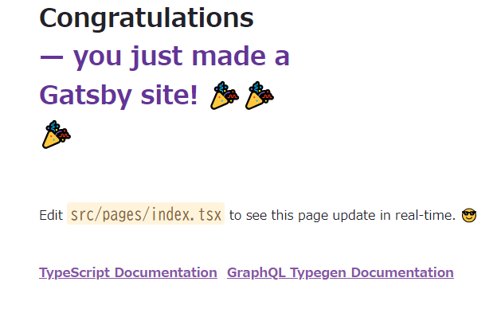

# gatsby-test

## サイト作成

```shell
node ➜ /workspaces/gatsby-test (main) $ gatsby new
create-gatsby version 3.13.1


                                                             Welcome to Gatsby!


This command will generate a new Gatsby site for you in /workspaces/gatsby-test with the setup you select. Let's answer some questions:


What would you like to call your site?
✔ · My Gatsby Site
What would you like to name the folder where your site will be created?
✔ gatsby-test/ my-gatsby-site
✔ Will you be using JavaScript or TypeScript?
· TypeScript
✔ Will you be using a CMS?
· No (or I'll add it later)
✔ Would you like to install a styling system?
· No (or I'll add it later)
✔ Would you like to install additional features with other plugins?
· Add responsive images
· Add an automatic sitemap


Thanks! Here's what we'll now do:

    🛠  Create a new Gatsby site in the folder my-gatsby-site
    🔌 Install gatsby-plugin-image, gatsby-plugin-sitemap, gatsby-transformer-remark


✔ Created site from template
✔ Installed Gatsby
✔ Installed plugins
✔ Created site in my-gatsby-site
🔌 Setting-up plugins...

info Adding gatsby-plugin-image
info Adding gatsby-plugin-sitemap
info Adding gatsby-transformer-remark
info Adding gatsby-plugin-sharp
info Adding gatsby-transformer-sharp
info Adding gatsby-source-filesystem
info Adding gatsby-source-filesystem
info Installed gatsby-plugin-image in gatsby-config
success Adding gatsby-plugin-image to gatsby-config - 0.148s
info Installed gatsby-plugin-sitemap in gatsby-config
success Adding gatsby-plugin-sitemap to gatsby-config - 0.151s
info Installed gatsby-transformer-remark in gatsby-config
success Adding gatsby-transformer-remark to gatsby-config - 0.156s
info Installed gatsby-plugin-sharp in gatsby-config
success Adding gatsby-plugin-sharp to gatsby-config - 0.163s
info Installed gatsby-transformer-sharp in gatsby-config
success Adding gatsby-transformer-sharp to gatsby-config - 0.176s
info Installed gatsby-source-filesystem in gatsby-config
success Adding gatsby-source-filesystem (images) to gatsby-config - 0.195s
info Installed gatsby-source-filesystem in gatsby-config
success Adding gatsby-source-filesystem (pages) to gatsby-config - 0.201s
🎉  Your new Gatsby site My Gatsby Site has been successfully created
at /workspaces/gatsby-test/my-gatsby-site.
Start by going to the directory with

  cd my-gatsby-site

Start the local development server with

  npm run develop

See all commands at

  https://www.gatsbyjs.com/docs/reference/gatsby-cli/
```

## 動確

```shell
node ➜ /workspaces/gatsby-test/my-gatsby-site (master) $ gatsby develop --host=0.0.0.0
```

* http://localhost:8000/



## ビルド

```shell
node ➜ /workspaces/gatsby-test/my-gatsby-site (master) $ gatsby build
```
